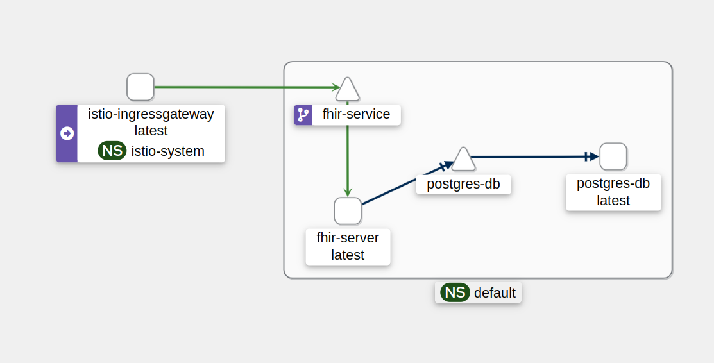
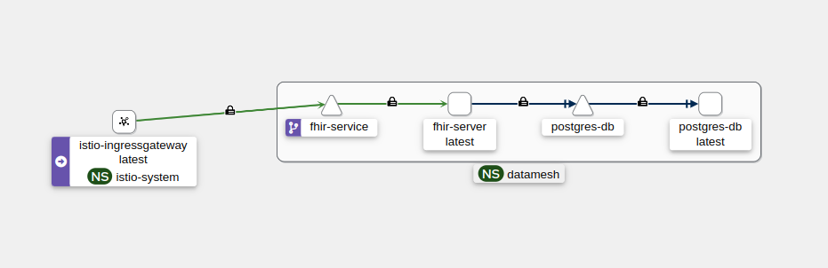

# WORKSHOP INSTRUCUTIONS

The main goal is to guide through a servioce mesh enforcing a zero trust network with authentication policies.

The tutorial was meant to be deployed on a Docker Desktop k8s enviroment. Feel free to open issues if you need help in other platforms

## Table of contents

- [WORKSHOP INSTRUCUTIONS](#workshop-instrucutions)
    - [Before you start](#before-you-start)
    - [Raw deployment FHIR + DB](#raw-deployment-fhir--db)
        - [Test](#test)
        - [Clean up](#clean-up)
    - [Mesh deployment (Istio)](#mesh-deployment-istio)
        - [Test](#test-mesh)
        - [Clean up](#clean-up-mesh)
    - [Securing the Mesh (mTLS)](#securing-the-mesh-mtls)
        - [Test](#testing-the-mtls-mesh)
        - [Clean up](#cleaning-up-mtls)
    - [Least privilege access](#least-privilege-access)
        - [Test](#testing-auth)
        - [Clean up](#cleaning-up-auth)

## Before you start

You must have access to a `kubernetes` cluster and `kubectl`.

In the [postman](./doc/postman/) folder you can find the Postman collection to test the FHIR endpoints and get the token for the users. It'll be used from the [Securing the Mesh](#securing-the-mesh-mtls) part to the end.

## Raw deployment FHIR + DB

In orther to deploy the raw enviroment without using Istio you must follow the next steps:

- Set up the database with the secrets, changing them with a proper password in the [001_postgress-secret.yaml](./kubernetes/raw-deployment/001_postgress-secret.yaml)

```shell 
# The user/password must be converted to base64 

echo -n "SuperSecurePass1234!" | base64 
```
- Then apply the following yaml's
```shell
kubectl apply -f kubernetes/raw-deployment/001_postgress-secret.yaml

kubectl apply -f kubernetes/raw-deployment/002_postgres-db.yaml

kubectl apply -f kubernetes/raw-deployment/003_postgres-svc.yaml

```
- Finally set up the FHIR server that depends on the postgres
```shell
kubectl apply -f kubernetes/raw-deployment/004_fhir-deployment.yaml
```

- With the config applied the expected output should be:

```shell
kubectl get all

# output

NAME                               READY   STATUS    RESTARTS   AGE
pod/fhir-server-5f4c6b6b8-hmksw    1/1     Running   0          x
pod/postgres-db-7cf44b646d-4n8kw   1/1     Running   0          x

NAME                  TYPE        CLUSTER-IP     EXTERNAL-IP   PORT(S)    AGE
service/kubernetes    ClusterIP   10.96.0.1      <none>        443/TCP    x
service/postgres-db   ClusterIP   10.97.173.90   <none>        5432/TCP   x

NAME                          READY   UP-TO-DATE   AVAILABLE   AGE
deployment.apps/fhir-server   1/1     1            1           x
deployment.apps/postgres-db   1/1     1            1           x

NAME                                     DESIRED   CURRENT   READY   AGE
replicaset.apps/fhir-server-5f4c6b6b8    1         1         1       x
replicaset.apps/fhir-server-7c4d84f949   0         0         0       x
replicaset.apps/postgres-db-7cf44b646d   1         1         1       x


```
### Test 

Some commands to test that the services behavior.

- In order to expose locally the FHIR server we need to create a service that gives access to it on a free port in our machine. If you are testing in a external cluster, exposing it through a gateway may be a better choice.

```shell
kubectl expose deployment/fhir-server --type="NodePort" --port 8080
```
- Once exposed it's usefull to set the port assigned to a variable doing
```shell 
export FHIR_PORT="$(kubectl get services/fhir-server -o go-template='{{(index .spec.ports 0).nodePort}}')"
```
- Then we can check if doing a curl to the Patient endpoints returns __200__ http code
```shell
curl "http://localhost:$FHIR_PORT/fhir/Patient" -X GET -sS -o /dev/null -w "%{http_code}\n"
```

### Clean up

- Before continuing to the next stage a clean up must be made so the changes on top of the previous are aplied.

```shell
kubectl delete -f kubernetes/raw-deployment/004_fhir-deployment.yaml

kubectl delete -f kubernetes/raw-deployment/002_postgres-db.yaml

kubectl delete -f kubernetes/raw-deployment/003_postgres-svc.yaml

kubectl delete -f kubernetes/raw-deployment/001_postgress-secret.yaml

kubectl delete svc fhir-server

```


## Mesh deployment (Istio)

- Now in order to set up the service mesh you must follow the installation steps in [istio.io](https://istio.io/latest/docs/setup/getting-started/#download) and get Istio.


- Once installed istioctl, apply the following command and enable the  injects the sidecar to the pods in the _default_ namespace.

```shell
istioctl install --set profile=demo -y 

kubectl label namespace default istio-injection=enabled --overwrite
```

- Then, in order to set up Istio's most usefull benefit, apply the prometheus and kiali observability tools. The "demo" profile installs the istiod components, the ingress and egress gateways

```shell
kubectl apply -f https://raw.githubusercontent.com/istio/istio/release-1.19/samples/addons/prometheus.yaml

kubectl apply -f https://raw.githubusercontent.com/istio/istio/release-1.19/samples/addons/kiali.yaml
```
- Next step is to set up the gateway throug the istio ingress to manage the conexions to the services in the mesh

```shell
kubectl apply -f kubernetes/mesh-deployment/002_gateway.yaml
```


- Then apply the following yaml's as in the previous stage
```shell
kubectl apply -f kubernetes/raw-deployment/001_postgress-secret.yaml

kubectl apply -f kubernetes/raw-deployment/002_postgres-db.yaml

kubectl apply -f kubernetes/raw-deployment/003_postgres-svc.yaml

```
- Finally set up the FHIR server that depends on the postgres
```shell
kubectl apply -f kubernetes/raw-deployment/004_fhir-deployment.yaml
```
- Some additional steps must be applied for Istio gateway to route the traffic through.For creating a svc for the FHIR server and applying the virtual service:

```shell
kubectl apply -f kubernetes/mesh-deployment/003_fhir-server-svc.yaml

kubectl apply -f kubernetes/mesh-deployment/004_fhir-server-vs.yaml

```

### Test mesh 

In order to test the istio injection use:

```shell
kubectl get namespace -L istio-injection
```
The result should look like this since we enabled injection in the default name space

```shell
NAME              STATUS   AGE    ISTIO-INJECTION
default           Active   x      enabled
istio-system      Active   x    
kube-node-lease   Active   x   
kube-public       Active   x   
kube-system       Active   x   
```

Using Kiali as an observability tool makes it simple to understand the capsule concept and the conexions between services

- To run it use the following command that opens a dashboard in the web browser
```shell
istioctl dashboard kiali
```
The result should show something like this in the __Graph__ section of the dashboard.



### Clean up mesh

- To completly remove the services and the Istio installation follow the next steps

```shell
kubectl delete -f kubernetes/raw-deployment/004_fhir-deployment.yaml

kubectl delete -f kubernetes/raw-deployment/002_postgres-db.yaml

kubectl delete -f kubernetes/raw-deployment/003_postgres-svc.yaml

kubectl delete -f kubernetes/raw-deployment/001_postgress-secret.yaml

istioctl uninstall --purge -y

kubectl delete namespace istio-system
```

## Securing the Mesh (mTLS)

For the next step we'll implement the secure comunication between services in the mesh using mTLS
After seting up Istio the same way that it's explained in the previous step and activating the proxy injection:

- Install Istio as in the previous steps

```shell
istioctl install --set profile=demo -y 
```
- The first thing is to set up a namespace to ensure the encapsulation of the services with mTLS. It also set the Istio sidecar injection automatically
```shell
kubectl apply -f kubernetes/mTLS/001_datamesh-ns.yaml
```
- Now we enforce the mTLS policy along the namespace we just created

```shell 
kubectl apply -f kubernetes/mTLS/002_mtls-policy.yaml
```
- Then we apply the rest of the yamls from the previous steps but with the namespace "datamesh"
```shell
kubectl apply -f kubernetes/mTLS/003_gateway.yaml

kubectl apply -f kubernetes/mTLS/004_postgress-secret-datamesh.yaml

kubectl apply -f kubernetes/mTLS/005_postgres-db-datamesh.yaml

kubectl apply -f kubernetes/mTLS/006_postgres-svc-datamesh.yaml

kubectl apply -f kubernetes/mTLS/007_fhir-deployment-datamesh.yaml

kubectl apply -f kubernetes/mTLS/008_fhir-server-svc.yaml

kubectl apply -f kubernetes/mTLS/009_fhir-server-vs.yaml

```

### Testing the mTLS mesh

- For testing purposes we can install Prometheus and Kiali and check the mTLS connections between services

```shell
kubectl apply -f https://raw.githubusercontent.com/istio/istio/release-1.19/samples/addons/prometheus.yaml

kubectl apply -f https://raw.githubusercontent.com/istio/istio/release-1.19/samples/addons/kiali.yaml
```

By applying the "STRICT" tag in the Istio [PeerAuthentication](./kubernetes/mTLS/002_mtls-policy.yaml) we don't allow any traffic inside the mesh that is not encrypted and we enable mTLS between services as we can see in the Kiali



Now we'll prove that, enforcinf the STRICT mTLS mode, no other service outside the namespace or inside withouth a sidecar injection is able to comunicate with the FHIR service or it's database.

- First we apply the sleep pod in the default namespace 
```shell
kubectl apply -f https://raw.githubusercontent.com/istio/istio/release-1.19/samples/sleep/sleep.yaml -n default
```
- Then we can curl to the services in the __datamesh__ namespace
```shell
kubectl exec "$(kubectl get pod -l app=sleep -n default -o jsonpath={.items..metadata.name})" -c sleep -n default -- curl fhir-service.datamesh.svc.cluster.local -s -o /dev/null -w "%{http_code}\n"

#It will time out since it can not see the services from other namespaces
```
- It can be seen in the Kiali dashboard as external agent that comes from the default ns trying to access a service that doesnt exists


### Cleaning up mTLS
```shell
# If you deployed the sleep pod it can be removed by:
kubectl delete -f https://raw.githubusercontent.com/istio/istio/release-1.19/samples/sleep/sleep.yaml -n default

###

kubectl delete -f https://raw.githubusercontent.com/istio/istio/release-1.19/samples/addons/prometheus.yaml

kubectl delete -f https://raw.githubusercontent.com/istio/istio/release-1.19/samples/addons/kiali.yaml

kubectl delete -f kubernetes/mTLS/003_gateway.yaml

kubectl delete -f kubernetes/mTLS/004_postgress-secret-datamesh.yaml

kubectl delete -f kubernetes/mTLS/005_postgres-db-datamesh.yaml

kubectl delete -f kubernetes/mTLS/006_postgres-svc-datamesh.yaml

kubectl delete -f kubernetes/mTLS/007_fhir-deployment-datamesh.yaml

kubectl delete -f kubernetes/mTLS/008_fhir-server-svc.yaml

kubectl delete -f kubernetes/mTLS/009_fhir-server-vs.yaml

kubectl delete -f kubernetes/mTLS/002_mtls-policy.yaml

kubectl delete -f kubernetes/mTLS/001_datamesh-ns.yaml

istioctl uninstall --purge -y

kubectl delete namespace istio-system
```

## Least privilege access 

For this step we assume that there is an authentication provicer that allows JWT such as Keycloak.

For the example I'm going to use [keycloak.idea.lst.tfo.upm.es](https://keycloak.idea.lst.tfo.upm.es/) hosted by LST for the IDEA4RC project. 

It contains a realm called IDEA4RC with 2 roles and 2 users as example


| User    | Password   | Role    | Allowed methods |
|---------|----------- |-------- | --------------- |
| Bob     | bob1234!   | Medic   | POST            |
| Alice   | alice1234! | Patient | GET             |

First step to implement the authorization is to follow the steps from [Securing the Mesh (mTLS)](#securing-the-mesh-mtls) to set up the mesh and the services.

- Then we need to set up a service to request auth based on a issuer and a jwksUri that comes from the keycloak

```shell
kubectl apply -f kubernetes/least-privilege-access/001_request-auth.yaml
```

- Then the policies for accesing the FHIR service must be created following the table above

```shell
kubectl apply -f kubernetes/least-privilege-access/002_auth-policy-medic.yaml

kubectl apply -f kubernetes/least-privilege-access/003_auth-policy-patient.yaml
```

### Testing auth

In order to test the users trying to access the fhir endpoint on specific HTTP method we first need to login and get the jwt that contains the assigned role for the users accessing the services.

- Logging in with the Patient (Alice)

```shell
    curl --location 'https://keycloak.idea.lst.tfo.upm.es/realms/IDEA4RC/protocol/openid-connect/token' \
         --header 'Content-Type: application/x-www-form-urlencoded' \
         --data-urlencode 'client_id=Istio' \
         --data-urlencode 'grant_type=password' \
         --data-urlencode 'username=alice' \
         --data-urlencode 'password=alice1234!'
```
- With the token that it returns you can now use it to GET in the FHIR service. In this example we get the resouces 'Patient' in the server

```shell
curl --location 'http://127.0.0.1/fhir/Patient' \
--header 'Authorization: Bearer <token>'
```

- To test the other method (POST) with Bob we'll follow the same methodology

```shell
curl --location 'https://keycloak.idea.lst.tfo.upm.es/realms/IDEA4RC/protocol/openid-connect/token' \
         --header 'Content-Type: application/x-www-form-urlencoded' \
         --data-urlencode 'client_id=Istio' \
         --data-urlencode 'grant_type=password' \
         --data-urlencode 'username=bob' \
         --data-urlencode 'password=bob1234!'

curl --location --request POST 'http://127.0.0.1/fhir/Patient' \
--header 'Authorization: Bearer <token>'
```
- To test a real Patient load apply. The test patient can be found in [demo_patient.json](./doc/fhir-resources/demo_patient.json).
```shell
cd doc/fhir-resources

curl --location --request POST 'http://127.0.0.1/fhir/Patient' \-H "Authorization: Bearer <token>" -H 'Content-Type: application/json'   -d ./doc/fhir-resources/@demo_patient.json 
```


### Cleaning up auth

```shell
kubectl delete -f kubernetes/least-privilege-access/001_request-auth.yaml

kubectl delete -f kubernetes/least-privilege-access/002_auth-policy-medic.yaml

kubectl delete -f kubernetes/least-privilege-access/003_auth-policy-patient.yaml

# If you deployed the sleep pod it can be removed by:
kubectl delete -f https://raw.githubusercontent.com/istio/istio/release-1.19/samples/sleep/sleep.yaml -n default

kubectl delete -f https://raw.githubusercontent.com/istio/istio/release-1.19/samples/addons/prometheus.yaml

kubectl delete -f https://raw.githubusercontent.com/istio/istio/release-1.19/samples/addons/kiali.yaml

kubectl delete -f kubernetes/mTLS/003_gateway.yaml

kubectl delete -f kubernetes/mTLS/004_postgress-secret-datamesh.yaml

kubectl delete -f kubernetes/mTLS/005_postgres-db-datamesh.yaml

kubectl delete -f kubernetes/mTLS/006_postgres-svc-datamesh.yaml

kubectl delete -f kubernetes/mTLS/007_fhir-deployment-datamesh.yaml

kubectl delete -f kubernetes/mTLS/008_fhir-server-svc.yaml

kubectl delete -f kubernetes/mTLS/009_fhir-server-vs.yaml

kubectl delete -f kubernetes/mTLS/002_mtls-policy.yaml

kubectl delete -f kubernetes/mTLS/001_datamesh-ns.yaml

istioctl uninstall --purge -y

kubectl delete namespace istio-system

```